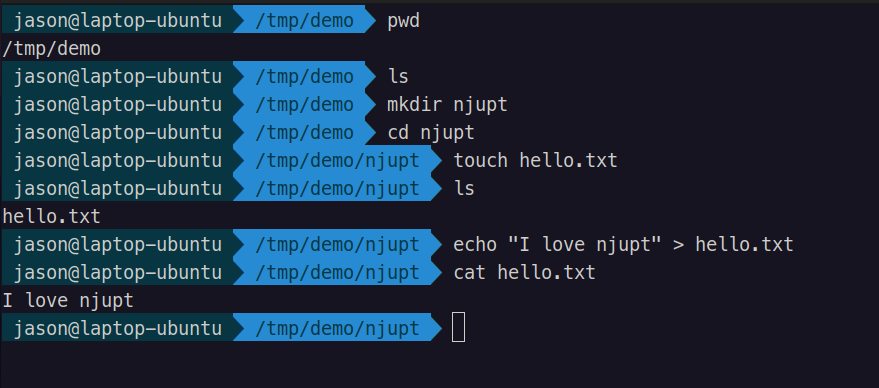

# 任务要求：
使用openssh-server连接虚拟机并完成基本命令操作 

但我装了双系统so... 


```shell
jason@laptop-ubuntu /tmp/demo > pwd
/tmp/demo
jason@laptop-ubuntu /tmp/demo > ls
jason@laptop-ubuntu /tmp/demo > mkdir njupt
jason@laptop-ubuntu /tmp/demo > cd njupt
jason@laptop-ubuntu /tmp/demo/njupt > touch hello.txt
jason@laptop-ubuntu /tmp/demo/njupt > ls
hello.txt
jason@laptop-ubuntu /tmp/demo/njupt > echo "I love njupt" > hello.txt
jason@laptop-ubuntu /tmp/demo/njupt > cat hello.txt
I love njupt
jason@laptop-ubuntu /tmp/demo/njupt >
```
 

放在/tmp了因为不想污染目录