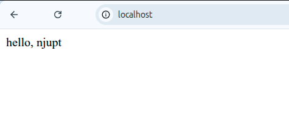

# 任务要求：
搭建 nginx 服务器，允许远程访问 

```shell
$  sudo su root 
root@laptop-ubuntu:/home/jason/projects/linux2026/B24060219汪嘉诚# cd /var/www/html/ 
root@laptop-ubuntu:/var/www/html# ls 
index.nginx-debian.html 
root@laptop-ubuntu:/var/www/html# vim index.html 
```



因为是物理机所以是localhost 